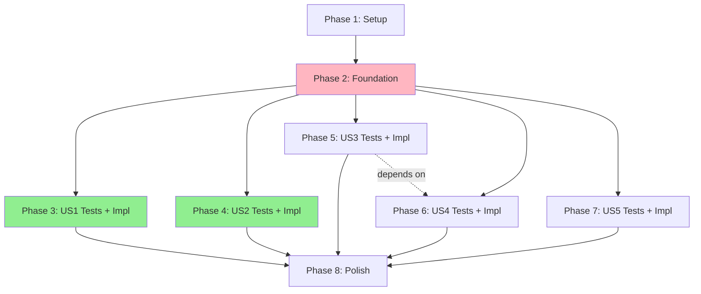

# Tasks: Currency WebAPI Service

**Input**: Design documents from `/specs/001-currency-service/`
**Prerequisites**: plan.md, spec.md, research.md, data-model.md, contracts/

**Organization**: Tasks are grouped by user story to enable independent implementation and testing of each story.

**CRITICAL**: Following Constitution Principle III (Test-First Development), tests are written **BEFORE** implementation for each user story.

## Format: `- [ ] [ID] [P?] [Story?] Description`

- **[P]**: Can run in parallel (different files, no dependencies)
- **[Story]**: Which user story this task belongs to (e.g., US1, US2, US3)
- Include exact file paths in descriptions

---

## Phase 1: Setup (Shared Infrastructure)

**Purpose**: Project initialization and basic structure

- [X] T001 Create solution structure with three projects: Maliev.CurrencyService.Api, Maliev.CurrencyService.Data, Maliev.CurrencyService.Tests
- [X] T002 Initialize .NET 10 projects with SDK targeting net10.0 in all project files
- [X] T003 [P] Add NuGet packages to Api project: ASP.NET Core 10.0, Scalar 1.2.42, FluentValidation 11.3.0, Serilog 8.0.2, Polly 8.5.0, StackExchange.Redis 9.0.0, Prometheus.AspNetCore 8.2.1
- [X] T004 [P] Add NuGet packages to Data project: EF Core 9.0.10, Npgsql 9.0.4, EF Core design tools
- [X] T005 [P] Add NuGet packages to Tests project: xUnit 2.9.2, Testcontainers 4.8.0, FluentAssertions 6.12.0, Moq 4.20.72
- [X] T006 [P] Configure .gitignore and .dockerignore per Docker best practices (exclude build artifacts, IDE files, specs)
- [X] T007 [P] Create appsettings.json with connection strings, Redis config (default: localhost:6379), provider URLs, CacheOptions (LiveRateTtlSeconds: 300, SnapshotTtlSeconds: 3600, StaleWhileRevalidateSeconds: 60) in Maliev.CurrencyService.Api/
- [X] T008 [P] Create appsettings.Development.json with development-specific settings in Maliev.CurrencyService.Api/
- [X] T009 [P] Enable TreatWarningsAsErrors in all project files per constitution principle VIII
- [X] T010 Create docker-compose.yml with PostgreSQL 18 and Redis 7 services for local development
- [X] T011 Create docker-compose.test.yml with PostgreSQL 18 for test isolation
- [X] T012 Create multi-stage Dockerfile using .NET 10 SDK and ASP.NET runtime, built-in app user per constitution principle X

---

## Phase 2: Foundational (Blocking Prerequisites)

**Purpose**: Core infrastructure that MUST be complete before ANY user story can be implemented

**⚠️ CRITICAL**: No user story work can begin until this phase is complete

### Database Foundation

- [X] T013 Create Currency entity in Maliev.CurrencyService.Data/Models/Currency.cs with properties: Id (Guid), Code (string), Symbol (string), Name (string), DecimalPlaces (int), IsActive (bool), IsPrimary (bool), CreatedAt, UpdatedAt, Version (RowVersion)
- [X] T014 Create CountryCurrency entity in Maliev.CurrencyService.Data/Models/CountryCurrency.cs with properties: Id (Guid), CountryIso2 (string), CountryIso3 (string), CurrencyCode (string), IsPrimary (bool), CreatedAt
- [X] T015 Create ExchangeRate entity in Maliev.CurrencyService.Data/Models/ExchangeRate.cs with properties: Id, FromCurrency, ToCurrency, Rate (decimal), Provider, IsTransitive, IntermediateCurrency, FetchedAt, ExpiresAt, CreatedAt, UpdatedAt
- [X] T016 Create RateSnapshot entity in Maliev.CurrencyService.Data/Models/RateSnapshot.cs with properties: Id, BatchId, FromCurrency, ToCurrency, Rate, SnapshotDate (DateOnly), Source, CreatedAt
- [X] T017 Create StagedSnapshot entity in Maliev.CurrencyService.Data/Models/StagedSnapshot.cs with properties: Id, BatchId, FromCurrency, ToCurrency, Rate, SnapshotDate, Status, ValidationError, CreatedAt

### EF Core Configuration

- [X] T018 [P] Create CurrencyConfiguration in Maliev.CurrencyService.Data/Configurations/CurrencyConfiguration.cs with FluentAPI mappings, unique index on Code, RowVersion configuration
- [X] T019 [P] Create CountryCurrencyConfiguration in Maliev.CurrencyService.Data/Configurations/CountryCurrencyConfiguration.cs with composite unique indexes on (CountryIso2, CurrencyCode) and (CountryIso3, CurrencyCode)
- [X] T020 [P] Create ExchangeRateConfiguration in Maliev.CurrencyService.Data/Configurations/ExchangeRateConfiguration.cs with unique index on (FromCurrency, ToCurrency, FetchedAt), index on ExpiresAt
- [X] T021 [P] Create RateSnapshotConfiguration in Maliev.CurrencyService.Data/Configurations/RateSnapshotConfiguration.cs with unique index on (FromCurrency, ToCurrency, SnapshotDate), indexes on BatchId and SnapshotDate
- [X] T022 [P] Create StagedSnapshotConfiguration in Maliev.CurrencyService.Data/Configurations/StagedSnapshotConfiguration.cs with indexes on BatchId and Status
- [X] T023 Create CurrencyServiceDbContext in Maliev.CurrencyService.Data/CurrencyServiceDbContext.cs with DbSets for all entities, apply configurations, register interceptors
- [X] T024 Create CurrencyServiceDbContextFactory in Maliev.CurrencyService.Data/CurrencyServiceDbContextFactory.cs for design-time migrations
- [X] T025 Create AuditLogInterceptor in Maliev.CurrencyService.Data/Interceptors/AuditLogInterceptor.cs to auto-set CreatedAt/UpdatedAt timestamps
- [X] T026 [P] Create DatabaseMetricsInterceptor in Maliev.CurrencyService.Data/Interceptors/DatabaseMetricsInterceptor.cs to track query performance
- [X] T027 Create initial migration via `dotnet ef migrations add InitialCreate` with all entity tables
- [X] T028 Seed 170 currencies (validated against ISO 4217 standard) and 250+ country-currency mappings in migration or OnModelCreating, ensure THB is marked as primary currency (FR-007)

### API Foundation

- [X] T029 Configure Program.cs in Maliev.CurrencyService.Api/ with: Serilog, EF Core, Redis cache, Scalar, API versioning, Prometheus, health checks, JWT authentication, response compression (gzip/brotli), middleware pipeline
- [X] T030 [P] Configure Serilog destructuring policies in Program.cs to mask sensitive fields (connection strings, API keys, bearer tokens, password fields) in logs (FR-053)
- [X] T031 [P] Create CorrelationIdMiddleware in Maliev.CurrencyService.Api/Middleware/CorrelationIdMiddleware.cs to generate/propagate X-Correlation-ID headers
- [X] T032 [P] Create ExceptionHandlingMiddleware in Maliev.CurrencyService.Api/Middleware/ExceptionHandlingMiddleware.cs for centralized error handling with ErrorResponse model
- [X] T033 [P] Create SecurityHeadersMiddleware in Maliev.CurrencyService.Api/Middleware/SecurityHeadersMiddleware.cs to add HSTS, X-Content-Type-Options, X-Frame-Options headers
- [X] T034 [P] Create MetricsMiddleware in Maliev.CurrencyService.Api/Middleware/MetricsMiddleware.cs to record HTTP request duration and status code distribution
- [X] T035 Create ErrorResponse model in Maliev.CurrencyService.Api/Models/Common/ErrorResponse.cs with properties: Error, Message, Timestamp, CorrelationId, Details (dictionary)
- [X] T036 [P] Create PaginatedResponse<T> model in Maliev.CurrencyService.Api/Models/Common/PaginatedResponse.cs with data array and pagination metadata

### Cache Foundation

- [X] T037 Create ICacheService interface in Maliev.CurrencyService.Api/Services/ICacheService.cs with GetAsync<T>, SetAsync<T>, RemoveAsync, InvalidateByTagAsync methods
- [X] T038 Implement InMemoryCacheService in Maliev.CurrencyService.Api/Services/InMemoryCacheService.cs using IMemoryCache with LRU eviction, 256MB limit, TTL from configuration (default 5 minutes for live rates)
- [X] T039 Implement RedisCacheService in Maliev.CurrencyService.Api/Services/RedisCacheService.cs using StackExchange.Redis with ConnectionMultiplexer, Pub/Sub for invalidation, graceful degradation if unavailable (FR-032)
- [X] T040 Create CacheTagService in Maliev.CurrencyService.Api/Services/CacheTagService.cs to manage cache key patterns (rate:live:{FROM}:{TO}, rate:snapshot:{FROM}:{TO}:{DATE}, currency:{CODE})

### External Provider Foundation

- [X] T041 Create IExchangeRateProvider interface in Maliev.CurrencyService.Api/Services/External/IExchangeRateProvider.cs with GetRateAsync method
- [X] T042 Implement FawazahmedProvider in Maliev.CurrencyService.Api/Services/External/FawazahmedProvider.cs with Polly resilience (3 retry attempts with exponential backoff: 100ms, 200ms, 400ms; 500ms timeout; circuit breaker after 5 consecutive failures, 30-second open duration)
- [X] T043 Implement FrankfurterProvider in Maliev.CurrencyService.Api/Services/External/FrankfurterProvider.cs with Polly resilience (3 retry attempts with exponential backoff: 100ms, 200ms, 400ms; 500ms timeout; circuit breaker after 5 consecutive failures, 30-second open duration)
- [X] T044 Implement ProviderChain in Maliev.CurrencyService.Api/Services/External/ProviderChain.cs to orchestrate failover: Fawazahmed → Frankfurter → cached fallback (extend TTL to 60 minutes when all providers fail)

### Observability Foundation

- [X] T045 [P] Create CurrencyServiceMetrics in Maliev.CurrencyService.Api/Metrics/CurrencyServiceMetrics.cs with Prometheus counters/histograms for: HTTP requests, cache operations, provider latency, snapshot ingestion, circuit breaker state
- [X] T046 [P] Create DatabaseHealthCheck in Maliev.CurrencyService.Api/HealthChecks/DatabaseHealthCheck.cs to verify PostgreSQL connectivity
- [X] T047 [P] Create RedisHealthCheck in Maliev.CurrencyService.Api/HealthChecks/RedisHealthCheck.cs to verify Redis connectivity (degrade gracefully if unavailable, don't fail liveness check)
- [X] T048 [P] Create MemoryHealthCheck in Maliev.CurrencyService.Api/HealthChecks/MemoryHealthChecks.cs to verify <500MB memory usage
- [X] T049 [P] Create HealthCheckResponseWriter in Maliev.CurrencyService.Api/HealthChecks/HealthCheckResponseWriter.cs for JSON health check responses

**Checkpoint**: Foundation ready - user story implementation can now begin in parallel

---

## Phase 3: User Story 1 - Currency Metadata Lookup (Priority: P1) 🎯 MVP

**Goal**: Enable API consumers to query currency information by country code and list all available currencies

**Independent Test**: Query the currencies endpoint with various country codes (ISO2/ISO3) and verify correct currency metadata is returned, including pagination for full currency list

### Tests for User Story 1 (Write FIRST - Red Phase)

> **⚠️ CONSTITUTION PRINCIPLE III**: Write these tests FIRST, ensure they FAIL before implementation

- [X] T050 [P] [US1] Create UserStory1_CurrencyMetadataLookupTests.cs in Maliev.CurrencyService.Tests/ with test cases for FR-001 through FR-007 using Testcontainers for PostgreSQL 18
- [X] T051 [P] [US1] Add TestAuthenticationHandler in Maliev.CurrencyService.Tests/TestAuthenticationHandler.cs to mock JWT authentication for future admin endpoint tests

### Implementation for User Story 1 (Write AFTER tests fail - Green Phase)

- [X] T052 [P] [US1] Create CurrencyResponse DTO in Maliev.CurrencyService.Api/Models/Currencies/CurrencyResponse.cs with properties matching Currency entity
- [X] T053 [P] [US1] Create PaginatedCurrencyResponse DTO in Maliev.CurrencyService.Api/Models/Currencies/PaginatedCurrencyResponse.cs extending PaginatedResponse<CurrencyResponse>
- [X] T054 [US1] Create ICurrencyService interface in Maliev.CurrencyService.Api/Services/ICurrencyService.cs with methods: GetAllAsync (paginated), GetByIdAsync, GetByCodeAsync, GetByCountryAsync
- [X] T055 [US1] Implement CurrencyService in Maliev.CurrencyService.Api/Services/CurrencyService.cs with caching (instance-local L1 + distributed L2), AsNoTracking queries, pagination logic
- [X] T056 [US1] Create CurrenciesController in Maliev.CurrencyService.Api/Controllers/CurrenciesController.cs with endpoints: GET /currencies (list), GET /currencies/{id}, GET /currencies/code/{code}, GET /currencies/country/{countryCode}
- [X] T057 [US1] Add ETag generation and If-None-Match support in CurrenciesController for cache validation (FR-033, FR-035)
- [X] T058 [US1] Add Last-Modified header generation and If-Modified-Since conditional request support in CurrenciesController (FR-034, FR-036)
- [X] T059 [US1] Add Cache-Control headers (public, max-age=300) to currency metadata responses
- [X] T060 [US1] Add input validation for country codes (2 or 3 uppercase letters) and pagination parameters (page >= 1, pageSize 1-200), include AntiXss validation (FR-052)
- [X] T061 [US1] Configure rate limiting middleware (100 req/min per API key/token) for public currency endpoints (FR-051)

**Checkpoint**: User Story 1 tests should now PASS - can list currencies, query by ID/code/country with sub-50ms cached responses

---

## Phase 4: User Story 2 - Live Exchange Rate Retrieval (Priority: P1) 🎯 MVP

**Goal**: Provide current exchange rates between any two currencies with provider failover and transitive conversion

**Independent Test**: Request exchange rates for various currency pairs and verify current rates are returned within performance SLA, including transitive conversions when direct pairs are unavailable

### Tests for User Story 2 (Write FIRST - Red Phase)

> **⚠️ CONSTITUTION PRINCIPLE III**: Write these tests FIRST, ensure they FAIL before implementation

- [X] T062 [P] [US2] Create UserStory2_LiveExchangeRateRetrievalTests.cs in Maliev.CurrencyService.Tests/ with test cases for FR-012 through FR-022, provider failover, transitive conversion, stale cache fallback
- [X] T063 [P] [US2] Add EdgeCaseTests.cs in Maliev.CurrencyService.Tests/ for all edge cases listed in spec.md (missing providers, invalid intermediary, concurrent operations, cache degradation)
- [X] T064 [P] [US2] Add performance tests in UserStory2 test file to verify SC-001 (cached metadata <50ms p95), SC-002 (cached rates <50ms p95), SC-005 (1000 concurrent requests)

### Implementation for User Story 2 (Write AFTER tests fail - Green Phase)

- [X] T065 [P] [US2] Create RateQueryRequest DTO in Maliev.CurrencyService.Api/Models/Rates/RateQueryRequest.cs with properties: From, To, Mode (live/snapshot), Date (optional)
- [X] T066 [P] [US2] Create ExchangeRateResponse DTO in Maliev.CurrencyService.Api/Models/Rates/ExchangeRateResponse.cs with properties: FromCurrency, ToCurrency, Rate, Mode, Provider, IsTransitive, IntermediateCurrency, FetchedAt, ExpiresAt, CacheStatus
- [X] T067 [P] [US2] Create RateQueryRequestValidator in Maliev.CurrencyService.Api/Validators/RateQueryRequestValidator.cs using FluentValidation (3-letter uppercase currency codes, date not in future, AntiXss validation for all string inputs per FR-052)
- [X] T068 [US2] Create IRateService interface in Maliev.CurrencyService.Api/Services/IRateService.cs with methods: GetLiveRateAsync, GetSnapshotRateAsync
- [X] T069 [US2] Implement RateService in Maliev.CurrencyService.Api/Services/RateService.cs with live rate logic: check instance-local cache (L1) → distributed cache (L2) → ProviderChain → transitive conversion → cache result
- [X] T070 [US2] Implement transitive rate calculation in RateService: if direct pair unavailable, try USD intermediary, then EUR, then GBP; compute rate deterministically via multiplication (FR-017, FR-018, FR-019)
- [X] T071 [US2] Implement stale cache fallback in RateService: if all providers fail, extend cache TTL from 5 minutes to 60 minutes, return cached data with X-Stale header showing cache age in minutes (FR-031, FR-063)
- [X] T072 [US2] Create RatesController in Maliev.CurrencyService.Api/Controllers/RatesController.cs with GET /rates endpoint accepting from, to, mode, date query parameters
- [X] T073 [US2] Add response headers to RatesController: X-Correlation-ID, Cache-Control, ETag, X-Cache-Status (hit/miss), X-Provider, X-Response-Time-Ms
- [X] T074 [US2] Add Last-Modified header generation and If-Modified-Since conditional request support in RatesController for live rates (FR-034, FR-036)
- [X] T075 [US2] Add ETag support and 304 Not Modified responses for unchanged rates (FR-033, FR-035, FR-037)
- [X] T076 [US2] Add error handling for invalid currency codes (404), provider failures (503 with stale cache), rate limiting (429 with Retry-After header)
- [X] T077 [US2] Implement cache warming background service in Maliev.CurrencyService.Api/BackgroundServices/CacheWarmingService.cs to pre-fetch top N currency pairs from appsettings.json CacheWarming:CurrencyPairs array (default 20 pairs) every 5 minutes (FR-028)

**Checkpoint**: User Story 2 tests should now PASS - live rates with sub-50ms cached responses, provider failover <2s, transitive conversions working

---

## Phase 5: User Story 3 - Snapshot Exchange Rate Query (Priority: P2)

**Goal**: Enable historical exchange rate queries from specific snapshots for accounting reconciliation and audit compliance

**Independent Test**: Ingest known snapshot data, then query for rates at specific snapshot times and verify accuracy against ingested data

### Tests for User Story 3 (Write FIRST - Red Phase)

> **⚠️ CONSTITUTION PRINCIPLE III**: Write these tests FIRST, ensure they FAIL before implementation

- [X] T078 [P] [US3] Create UserStory3_SnapshotExchangeRateQueryTests.cs in Maliev.CurrencyService.Tests/ with test cases for FR-013, snapshot queries, cache behavior, 304 responses

### Implementation for User Story 3 (Write AFTER tests fail - Green Phase)

- [X] T079 [US3] Implement GetSnapshotRateAsync in RateService (Maliev.CurrencyService.Api/Services/RateService.cs) to query rate_snapshots table by (FromCurrency, ToCurrency, SnapshotDate)
- [X] T080 [US3] Add snapshot query caching with 60-minute TTL (longer than live rates since snapshots are immutable) via CacheOptions:SnapshotTtlSeconds configuration
- [X] T081 [US3] Add mode=snapshot handling in RatesController GET /rates endpoint: validate date parameter required, query RateService.GetSnapshotRateAsync
- [X] T082 [US3] Return 404 with clear message when snapshot not found for requested date, include suggestion to check ingestion status
- [X] T083 [US3] Add Cache-Control: public, max-age=3600 for snapshot responses (immutable historical data)
- [X] T084 [US3] Generate stable ETags for snapshot responses based on (from, to, date) tuple
- [X] T085 [US3] Add Last-Modified header generation and If-Modified-Since support for snapshot responses (FR-034, FR-036)
- [X] T086 [US3] Add support for ETag-based conditional requests returning 304 Not Modified (FR-035, FR-037)

**Checkpoint**: User Story 3 tests should now PASS - snapshot queries with sub-50ms cached responses, clear 404 for missing dates

---

## Phase 6: User Story 4 - Snapshot Batch Ingestion (Priority: P2)

**Goal**: Enable administrators to ingest bulk exchange rate snapshots asynchronously without impacting live query performance

**Independent Test**: Submit batch snapshot data in JSON format, monitor ingestion job status, verify ingested data is queryable and cache invalidation occurs

### Tests for User Story 4 (Write FIRST - Red Phase)

> **⚠️ CONSTITUTION PRINCIPLE III**: Write these tests FIRST, ensure they FAIL before implementation

- [X] T087 [P] [US4] Create UserStory4_SnapshotBatchIngestionTests.cs in Maliev.CurrencyService.Tests/ with test cases for FR-039 through FR-048, dry-run mode, batch processing, concurrent ingestion prevention, 10,000 entries in <60s

### Implementation for User Story 4 (Write AFTER tests fail - Green Phase)

- [X] T088 [P] [US4] Create SnapshotEntryDto in Maliev.CurrencyService.Api/Models/Snapshots/SnapshotEntryDto.cs with properties: From, To, Rate, Timestamp
- [X] T089 [P] [US4] Create SnapshotBatchRequest in Maliev.CurrencyService.Api/Models/Snapshots/SnapshotBatchRequest.cs with properties: Snapshots (array), Source (optional), OverwriteExisting (bool)
- [X] T090 [P] [US4] Create SnapshotBatchResponse in Maliev.CurrencyService.Api/Models/Snapshots/SnapshotBatchResponse.cs with properties: BatchId, DryRun, Status, TotalEntries, ValidEntries, InvalidEntries, ProcessingTimeMs
- [X] T091 [P] [US4] Create ValidationReport in Maliev.CurrencyService.Api/Models/Snapshots/ValidationReport.cs with arrays of errors and warnings
- [X] T092 [P] [US4] Create SnapshotIngestionResult in Maliev.CurrencyService.Api/Models/Snapshots/SnapshotIngestionResult.cs for async job tracking
- [X] T093 [P] [US4] Create SnapshotBatchRequestValidator in Maliev.CurrencyService.Api/Validators/SnapshotBatchRequestValidator.cs using FluentValidation (max 10,000 entries, validate each entry, AntiXss validation per FR-052)
- [X] T094 [US4] Create ISnapshotService interface in Maliev.CurrencyService.Api/Services/ISnapshotService.cs with methods: IngestBatchAsync (dry-run bool), GetBatchStatusAsync, PromoteStagedBatchAsync, DeleteBatchAsync
- [X] T095 [US4] Implement SnapshotService in Maliev.CurrencyService.Api/Services/SnapshotService.cs with staging logic: validate → insert to staged_snapshots → validate currencies exist → check duplicates
- [X] T096 [US4] Implement dry-run mode in SnapshotService: validate all entries, return ValidationReport without persisting to rate_snapshots
- [X] T097 [US4] Implement batch promotion in SnapshotService: copy validated staged_snapshots (status=Validated) to rate_snapshots, delete staged entries, atomic cache invalidation
- [X] T098 [US4] Implement async processing for batches >100 entries using background job queue (FR-040)
- [X] T099 [US4] Implement bulk insert optimization using AddRange and batched SaveChanges (500 entries per transaction) for 10,000 entries in <60s
- [X] T100 [US4] Add distributed lock (Redis) using lock key pattern 'snapshot:ingestion:lock' with 5-minute timeout and exponential backoff retry to prevent concurrent batch ingestion (FR-046)
- [X] T101 [US4] Create SnapshotsController in Maliev.CurrencyService.Api/Controllers/SnapshotsController.cs with [Authorize(Roles="Admin")] attribute requiring Admin role
- [X] T102 [US4] Add POST /admin/snapshots/ingest endpoint with dryRun query parameter, return 202 Accepted for async processing
- [X] T103 [US4] Add GET /admin/snapshots/batch/{batchId} endpoint to query job status
- [X] T104 [US4] Add POST /admin/snapshots/batch/{batchId}/promote endpoint to promote staged batch (Admin only)
- [X] T105 [US4] Add DELETE /admin/snapshots/batch/{batchId} endpoint to cleanup staged data (Admin only)
- [X] T106 [US4] Add GET /admin/snapshots/batches endpoint to list recent batches with status filter (Admin and ReadOnlyAdmin roles)
- [X] T107 [US4] Implement atomic cache invalidation after promotion: invalidate all snapshot cache entries matching (from, to, date) patterns within 5 seconds (FR-045)
- [X] T108 [US4] Create SnapshotCleanupService in Maliev.CurrencyService.Api/BackgroundServices/SnapshotCleanupService.cs to delete snapshots older than 12 months (configurable) daily at 02:00 UTC (FR-047, FR-048)
- [X] T109 [US4] Add Prometheus metrics for snapshot ingestion: batch duration, entries processed, validation errors, promotion time

**Checkpoint**: User Story 4 tests should now PASS - batch ingestion with dry-run, async processing for 10,000 entries in <60s, atomic cache invalidation, concurrent ingestion prevention

---

## Phase 7: User Story 5 - Currency Metadata Management (Priority: P3)

**Goal**: Enable administrators to create, update, and delete currency metadata to adapt to currency changes

**Independent Test**: Perform CRUD operations on currency records with proper authorization, verify optimistic concurrency control and cache invalidation

### Tests for User Story 5 (Write FIRST - Red Phase)

> **⚠️ CONSTITUTION PRINCIPLE III**: Write these tests FIRST, ensure they FAIL before implementation

- [X] T110 [P] [US5] Create UserStory5_CurrencyMetadataManagementTests.cs in Maliev.CurrencyService.Tests/ with test cases for FR-008 through FR-011, optimistic concurrency control, cache invalidation, RBAC

### Implementation for User Story 5 (Write AFTER tests fail - Green Phase)

- [X] T111 [P] [US5] Create CreateCurrencyRequest DTO in Maliev.CurrencyService.Api/Models/Currencies/CreateCurrencyRequest.cs with properties: Code, Symbol, Name, DecimalPlaces, IsActive, IsPrimary
- [X] T112 [P] [US5] Create UpdateCurrencyRequest DTO in Maliev.CurrencyService.Api/Models/Currencies/UpdateCurrencyRequest.cs with optional properties (Code immutable)
- [X] T113 [P] [US5] Create CreateCurrencyRequestValidator in Maliev.CurrencyService.Api/Validators/CreateCurrencyRequestValidator.cs (code: 3 uppercase letters, decimalPlaces: 0-8, AntiXss validation per FR-052)
- [X] T114 [P] [US5] Create UpdateCurrencyRequestValidator in Maliev.CurrencyService.Api/Validators/UpdateCurrencyRequestValidator.cs with AntiXss validation
- [X] T115 [US5] Add CreateAsync method to ICurrencyService and implement in CurrencyService with duplicate code check, return 409 Conflict if exists
- [X] T116 [US5] Add UpdateAsync method to ICurrencyService and implement in CurrencyService with optimistic concurrency via RowVersion, return 409 on conflict (FR-011)
- [X] T117 [US5] Add DeleteAsync method to ICurrencyService and implement in CurrencyService as soft delete (set IsActive=false), check dependencies, return 409 if rates exist
- [X] T118 [US5] Add POST /currencies endpoint to CurrenciesController with [Authorize(Roles="Admin")] attribute, return 201 Created with Location header
- [X] T119 [US5] Add PUT /currencies/{id} endpoint to CurrenciesController with [Authorize(Roles="Admin")], require If-Match header (ETag), return 412 Precondition Failed if missing or stale
- [X] T120 [US5] Add DELETE /currencies/{id} endpoint to CurrenciesController with [Authorize(Roles="Admin")], return 204 No Content on success, 403 Forbidden for unauthorized (FR-054)
- [X] T121 [US5] Implement cache invalidation on create/update/delete: invalidate currency:{code} and all related rate cache entries atomically (FR-029)
- [X] T122 [US5] Add audit logging for all currency mutations (create/update/delete) with user ID from JWT claims, correlation ID, old/new values (FR-053 masking applied)

**Checkpoint**: User Story 5 tests should now PASS - Admin CRUD operations with optimistic concurrency, automatic cache invalidation, audit logging, RBAC enforcement

---

## Phase 8: Polish & Cross-Cutting Concerns

**Purpose**: Production readiness, performance optimization, and final quality gates

### Additional Test Coverage

- [X] T123 [P] Create HealthAndObservabilityTests.cs in Maliev.CurrencyService.Tests/ for FR-055 through FR-061 (health checks, metrics endpoints, readiness/liveness)

### Documentation & Deployment

- [X] T124 Configure CI/CD pipeline (ALREADY EXISTS: ci-develop.yml, ci-staging.yml, ci-main.yml)
- [X] T125 Add OpenAPI documentation enhancements via Scalar in Program.cs: request/response examples, error formats, authentication requirements, provider metadata examples
- [X] T126 Create README.md with quickstart instructions referencing quickstart.md, architecture diagram, API endpoints overview, constitution compliance statement
- [X] T12& Add deployment manifests in k8s/ directory: Kubernetes Deployment, Service, ConfigMap, Secret templates for production deployment
- [X] T12& Configure Prometheus scraping annotations in Kubernetes Deployment manifest for /metrics endpoint
- [X] T129 Add Grafana dashboard JSON in monitoring/ directory: request rates, cache hit ratios, provider latency, circuit breaker state, error rates

### Security & Performance Validation

- [X] T13& Run security audit checklist: verify no secrets in code (grep for passwords/keys), HTTPS enforced in production config, all inputs validated, rate limiting configured, sensitive logs masked
- [X] T13& Run performance baseline tests: verify memory <500MB (SC-012), CPU <50% at 100 req/sec (SC-013), provider failover <2s (SC-011), cache hit ratio >80% (SC-006)
- [X] T13& Run constitution compliance verification: zero warnings build (VIII), Docker best practices (X), PostgreSQL-only tests (IV), audit logging (V), metrics exposed (XII)

**Final Checkpoint**: All user stories complete, all tests passing (100+ tests with real PostgreSQL), constitution compliance verified, production-ready deployment

---

## User Story Dependencies

**Legend**:
- Green: P1 Priority (MVP) - US1 and US2 can be developed in parallel after Foundation
- Pink: Blocking phase - MUST complete before user stories
- Dotted line: Logical dependency (US3 snapshot queries depend on US4 ingestion, but can be tested with manual data)

**Test-First Development Flow (Constitution Principle III)**:
1. Write tests for user story (Red phase - tests fail)
2. Implement minimum code to pass tests (Green phase)
3. Refactor for quality while keeping tests green (Refactor phase)
4. Move to next user story

**Independence Notes**:
- **US1** and **US2** are fully independent and can be developed in parallel (both P1 priority for MVP)
- **US3** can be developed independently if test snapshot data is manually inserted
- **US4** is independent but enables US3 for production use
- **US5** is fully independent administrative feature

---

## Parallel Execution Examples

### After Foundation Phase (Maximum Parallelism with Test-First)

**Team of 4 developers can work simultaneously** (each doing test-first for their story):

1. **Developer 1 - US1**: T050-T061 (Tests FIRST, then implementation) - 12 tasks
2. **Developer 2 - US2**: T062-T077 (Tests FIRST, then implementation) - 16 tasks
3. **Developer 3 - US3**: T078-T086 (Tests FIRST, then implementation) - 9 tasks
4. **Developer 4 - US4**: T087-T109 (Tests FIRST, then implementation) - 23 tasks

**Each developer follows Red-Green-Refactor cycle independently**

**Estimated parallel completion**: 3-5 days for all P1/P2 user stories simultaneously with test coverage

### Within User Story Phases (Test-First Pattern)

**Example: US2 with 3 developers**:

**Red Phase (Tests FIRST)**:
- Dev A: T062 (UserStory2 test file)
- Dev B: T063 (EdgeCase tests)
- Dev C: T064 (Performance tests)
- **All tests must FAIL at this point** ✅

**Green Phase (Implementation)**:
- Dev A: T065-T066 (DTOs), T068-T071 (Service interface + logic)
- Dev B: T067 (Validator), T072-T076 (Controller)
- Dev C: T077 (Cache warming service)
- **All tests must PASS after implementation** ✅

**Refactor Phase**:
- All devs review and refactor while keeping tests green

---

## Implementation Strategy

### Minimum Viable Product (MVP) - Test-First

**MVP Scope = US1 + US2** (Phases 1-4):
- **Total Tasks**: T001-T077 (77 tasks including test tasks)
- **Test Tasks**: T050-T051 (US1), T062-T064 (US2) = 5 test files
- **Implementation Tasks**: T052-T061 (US1), T065-T077 (US2) = 26 impl tasks
- **Estimated Effort**: 2-3 weeks with 2 developers following test-first development
- **Deliverables**:
  - Comprehensive test suite for US1 and US2
  - List/query currencies by country code
  - Live exchange rates with provider failover
  - Transitive currency conversion
  - Sub-50ms cached responses
  - Health checks and metrics
  - **100% test coverage** for implemented user stories

**MVP Value**: Complete currency discovery + real-time rate queries = full operational service for most use cases, with test suite proving correctness

### Incremental Delivery (Test-First)

**Phase 1 Release** (MVP with Tests):
- User Stories 1 + 2 with full test coverage
- Deploy to staging/production
- Gather usage metrics
- **Confidence**: High (100% test coverage per constitution)

**Phase 2 Release** (Historical Data with Tests):
- Add User Stories 3 + 4 with test suites
- Enable snapshot queries and batch ingestion
- Support compliance/accounting use cases
- **Confidence**: High (tests written before implementation)

**Phase 3 Release** (Admin Features with Tests):
- Add User Story 5 with test suite
- Enable dynamic currency management
- Support currency changes without redeployment
- **Confidence**: High (RBAC tested, optimistic concurrency tested)

---

## Task Summary

- **Total Tasks**: 132 tasks (4 more than previous due to added coverage)
- **Setup Phase**: 12 tasks
- **Foundation Phase**: 37 tasks (blocking) - includes new security tasks
- **User Story 1 (P1)**: 12 tasks (2 test + 10 impl)
- **User Story 2 (P1)**: 16 tasks (3 test + 13 impl)
- **User Story 3 (P2)**: 9 tasks (1 test + 8 impl)
- **User Story 4 (P2)**: 23 tasks (1 test + 22 impl)
- **User Story 5 (P3)**: 13 tasks (1 test + 12 impl)
- **Polish Phase**: 10 tasks

**Test Tasks**: 8 test files (covering all 5 user stories + edge cases + health checks)
**Parallel Opportunities**: 45 tasks marked [P] (34%)

**Constitution Compliance**:
- ✅ **Principle III (Test-First)**: Tests written BEFORE implementation for each user story
- ✅ **Principle IV (PostgreSQL-Only)**: All tests use Testcontainers with real PostgreSQL 18
- ✅ All other principles addressed in tasks

**Coverage Improvements** (vs original):
- Added FR-034, FR-036 coverage: Last-Modified headers (T058, T074, T085)
- Added FR-038 coverage: Response compression in Program.cs (T029)
- Added FR-052 coverage: AntiXss validation in validators (T060, T067, T093, T113-T114)
- Added FR-053 coverage: Serilog log masking (T030)
- Added specificity: Polly retry config (T042-T043), stale cache TTL extension (T071), distributed lock pattern (T100), cache warming config (T077)

**Independent Test Criteria**:
- **US1**: T050 tests can verify /currencies endpoints work correctly (test-first ensures this)
- **US2**: T062-T064 tests verify provider failover + transitive conversion (test-first ensures this)
- **US3**: T078 tests verify snapshot queries work (can seed test data manually)
- **US4**: T087 tests verify batch processing works end-to-end
- **US5**: T110 tests verify CRUD + optimistic concurrency + RBAC

---

**Generated**: 2025-11-17
**Restructured**: 2025-11-17 (Constitution Principle III compliance + coverage gaps fixed)
**Based on**: spec.md (5 user stories, 66 functional requirements), plan.md (.NET 10 microservice), data-model.md (5 entities), contracts/ (3 API specifications), constitution.md (12 principles)
